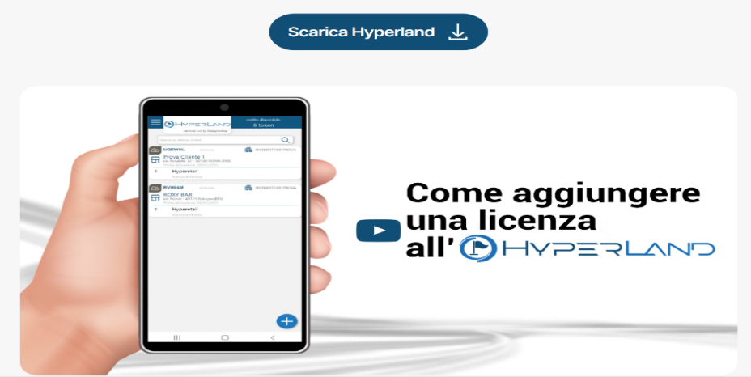
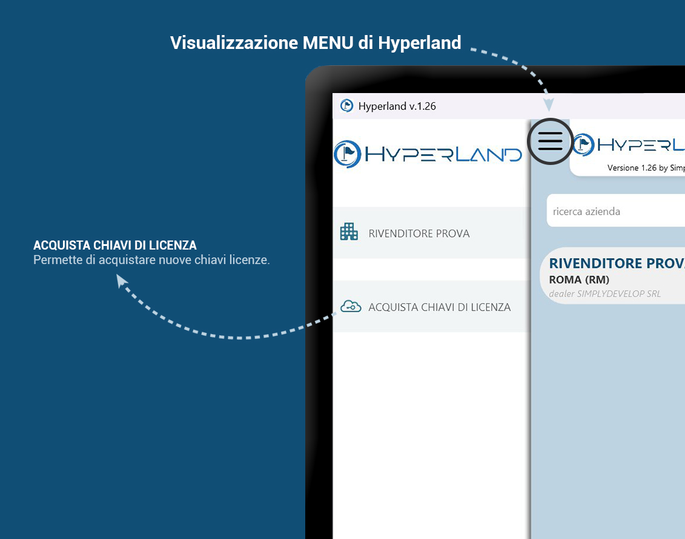
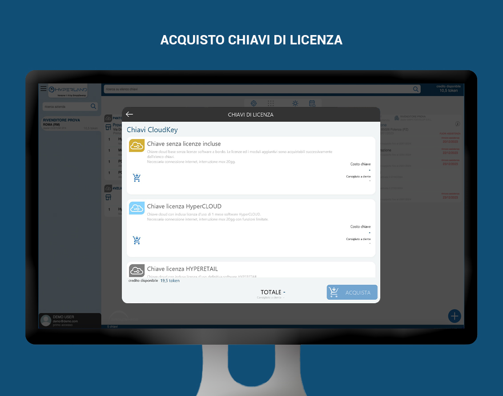
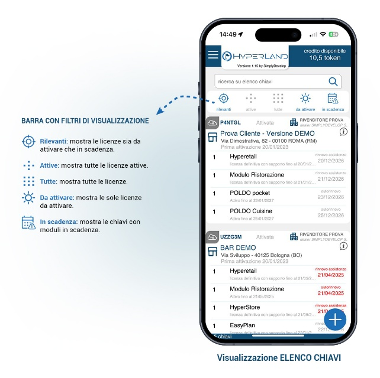
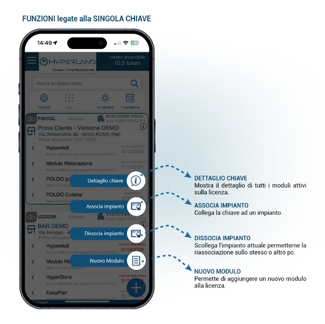

<video controls width="680" style="max-width: 100%;">
  <source src="../assets/resources/acquisto_licenza.mp4" type="video/mp4">
  Il tuo browser non supporta la riproduzione video.
</video>

# HyperLand: La piattaforma di gestione licenze

**HyperRetailCloud StartUp Level 1** | *Custom S.p.A. © 2026*

---

HyperLand è l'applicazione esclusiva per i partner Custom che permette di gestire in totale autonomia tutte le licenze HyperRetailCloud: acquisto, attivazione, abbinamento hardware, caricamento token e monitoraggio dello stato delle licenze attive.

!!! warning "Punto di partenza obbligatorio"
    HyperLand è il punto di partenza obbligatorio per qualsiasi operazione su HyperRetailCloud: **senza HyperLand non è possibile attivare o gestire nessuna licenza**.

---

## 1. Come scaricare HyperLand

{ align=right width=340 }

HyperLand è disponibile gratuitamente per **Windows** e **Android**.

Per la prima registrazione occorre necessariamente almeno una **cartolina nera HyperRetail** (contiene 5 Token). Il QR Code stampato sulla cartolina svolge un doppio ruolo:

- **Link di download automatico** — scansionando il QR, HyperLand (versione Android) si scarica e installa automaticamente
- **Codice di ricarica token** — la stessa scansione accredita i 5 token sul profilo

Una sola scansione, due funzioni.

<br clear="right"/>

---

## 2. Registrazione e accesso al profilo partner

La registrazione su HyperLand è **riservata ai partner Custom** che hanno già acquistato almeno una cartolina HyperRetail. Questo garantisce che solo i rivenditori effettivamente attivi possano accedere alla piattaforma.

!!! note "Requisito di accesso"
    Non è possibile registrarsi senza avere una cartolina HyperRetail a disposizione.

---

## 3. Caricare i token — la valuta del sistema

I **token** sono l'unico mezzo per acquistare e attivare licenze e moduli su HyperRetailCloud. Prima di fare qualsiasi cosa, è necessario avere token disponibili nel proprio profilo HyperLand.

Il costo standard è **€ 50,00 per token**. Esistono promozioni volume — contatta il tuo Area Manager per le tariffe agevolate.

### Modalità 1 — Acquisto online su custom4u.it

Accedi al portale [custom4u.it](https://custom4u.it) con le credenziali partner e acquista i token direttamente online. I token vengono accreditati immediatamente sul profilo HyperLand.

### Modalità 2 — Cartolina fisica 5 TOKEN

La cartolina nera HyperRetail contiene 5 token precaricati. Il QR Code ha un doppio ruolo:

- Fa scaricare automaticamente HyperLand (se non ancora installato)
- Ricarica i 5 token sul profilo

Per i partner che usano la cartolina dopo la prima registrazione, si scansiona direttamente dall'app HyperLand.

---

## 4. Acquistare una licenza HyperRetailCloud

{ align=right width=300 }

Con i token disponibili nel profilo, puoi procedere all'acquisto della chiave di licenza HyperRetailCloud.

**L'acquisto della chiave costa 1 token (€ 50,00 — una tantum)** e genera una licenza cloud pronta per essere abbinata a un dispositivo.

Dal menu principale di HyperLand seleziona **"Acquista chiavi di licenza"** per accedere alla sezione di acquisto.

<br clear="right"/>

{ width=680 }

Nella schermata **Chiavi di Licenza** trovi i diversi tipi di chiave disponibili:

| Tipo chiave | Descrizione | Note |
|-------------|-------------|------|
| **Chiave senza licenze incluse** | Chiave cloud base senza licenze software. Licenze e moduli si acquistano successivamente dall'elenco chiavi. | Connessione internet richiesta; interruzione max 20gg |
| **Chiave licenza HyperCLOUD** | Chiave cloud con inclusa licenza d'uso 1 mese software HyperCLOUD. | Connessione internet richiesta; interruzione max 20gg con funzioni limitate |
| **Chiave licenza HYPERETAIL** | Chiave cloud con inclusa licenza d'uso definitiva software HYPERETAIL. | |

---

## 5. Abbinare la licenza al dispositivo del cliente

L'**abbinamento** è il passaggio che attiva operativamente la licenza sul dispositivo del cliente. Può essere eseguito sia su Windows che su Android, semplicemente leggendo il **QR Code** che HyperRetailCloud mostra all'avvio.

**Procedura:**

1. Avvia HyperRetailCloud sul dispositivo del cliente — all'avvio, il software mostra il QR Code di abbinamento
2. Da HyperLand, apri la licenza acquistata e seleziona **"Associa impianto"**
3. Inquadra il QR Code del dispositivo con la fotocamera
4. La licenza viene abbinata istantaneamente — il dispositivo è operativo

!!! tip "Nessun tecnico remoto necessario"
    L'abbinamento è completamente autonomo. Non è richiesto nessun intervento da parte di Custom S.p.A.

---

## 6. Gestione delle licenze attive

Dalla dashboard HyperLand puoi vedere e gestire in qualsiasi momento tutte le licenze attive dei tuoi clienti. Ogni operazione è immediata e non richiede intervento di Custom.

{ align=right width=300 }

### Barra con filtri di visualizzazione

L'elenco chiavi mostra tutte le licenze del tuo portafoglio clienti. Usa i filtri per navigare rapidamente:

- **Rilevanti** — mostra le licenze sia da attivare che in scadenza
- **Attive** — mostra tutte le licenze attive
- **Tutte** — mostra tutte le licenze
- **Da attivare** — mostra le sole licenze da attivare
- **In scadenza** — mostra le chiavi con moduli in scadenza

<br clear="right"/>

### Cosa puoi fare su ogni licenza

{ align=right width=300 }

Toccando una chiave nell'elenco, appaiono le azioni disponibili:

- **Dettaglio chiave** — mostra il dettaglio di tutti i moduli attivi sulla licenza
- **Associa impianto** — collega la chiave a un impianto tramite QR Code
- **Dissocia impianto** — scollega l'impianto attuale, permettendo la riassociazione sullo stesso o altro PC/device
- **Nuovo modulo** — permette di aggiungere un nuovo modulo alla licenza

<br clear="right"/>

Le azioni complete disponibili su ogni licenza sono:

| Azione | Descrizione |
|--------|-------------|
| Visualizzare lo stato | Attiva, sospesa, non abbinata — con data di scadenza e prossimo addebito |
| Sospendere la licenza | Il canone si interrompe immediatamente. La licenza resta nel profilo |
| Riattivare la licenza | Con un click la licenza torna attiva e riprende il canone mensile |
| Spostare la licenza | Disabbina dal dispositivo attuale e abbina a un nuovo hardware — senza costi aggiuntivi |
| Bloccare la licenza | In caso di insolvenza del cliente, blocca l'accesso al software in pochi secondi |
| Aggiungere moduli | Attiva moduli aggiuntivi (Monopolio, Ristorazione, HyperStore, PLUS, LiveRetail) direttamente dalla licenza |

---

## 7. Riepilogo — il flusso completo

```
FLUSSO COMPLETO PRIMA ATTIVAZIONE
=====================================

① PREREQUISITO
   Cartolina nera HyperRetail (5 token)

② DOWNLOAD HYPERLAND
   Scansiona il QR → HyperLand si installa + 5 token accreditati

③ REGISTRAZIONE PROFILO PARTNER
   Solo con cartolina valida — accesso esclusivo partner Custom

④ ACQUISTO TOKEN AGGIUNTIVI
   custom4u.it oppure cartoline aggiuntive

⑤ ACQUISTO CHIAVE LICENZA
   1 token = 1 licenza CloudKey HyperRetailCloud (una tantum)

⑥ ABBINAMENTO DISPOSITIVO
   HyperLand → Associa impianto → QR Code sul device del cliente

⑦ ATTIVAZIONE MODULI
   Aggiungi Ristorazione, Monopolio, HyperStore, ecc. dalla licenza

⑧ OPERATIVO
   Il cliente può usare HyperRetailCloud
```

---

[← Introduzione](index.md) | [Successivo: Cap. 2 — Anagrafiche e Schermate →](cap2_anagrafiche.md)

*Custom S.p.A. © 2026 — Uso riservato ai partner autorizzati*
