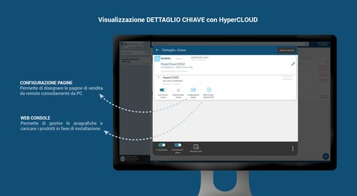
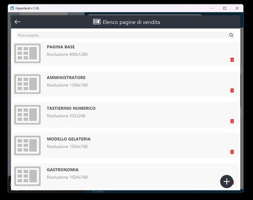
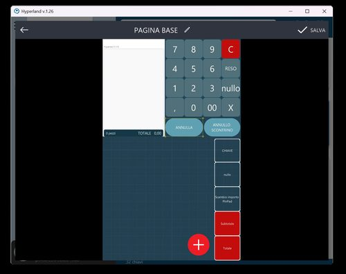
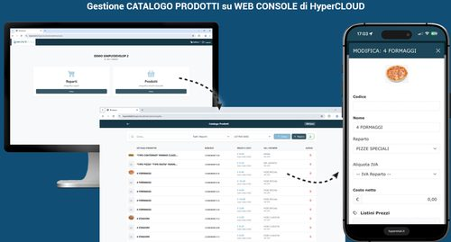

# Cap. 2 — HyperLand: Anagrafiche e Schermate di Vendita

**HyperRetailCloud StartUp Level 1** | *Custom S.p.A. © 2026*

---

In questo capitolo vedremo come gestire le anagrafiche del cliente e come personalizzare le schermate di vendita direttamente da HyperLand, in totale autonomia e **da remoto** — senza dover essere fisicamente presenti al punto cassa.

!!! tip "HyperRetailCloud funziona subito, senza configurare nulla"
    La schermata di vendita si popola automaticamente man mano che si inseriscono reparti e articoli. La personalizzazione grafica è un grandissimo plus, ma non è un prerequisito: **puoi fare il primo scontrino in 5 minuti dall'installazione**.

---

## 1. Il Dettaglio Chiave — punto di partenza

Dalla dashboard HyperLand, cliccando su una licenza attiva si accede al **Dettaglio Chiave**: la schermata che raccoglie tutte le opzioni di gestione e configurazione della licenza.

{ width=680 }

Dal Dettaglio Chiave sono disponibili le seguenti azioni:

| Azione | Descrizione | Disponibilità |
|--------|-------------|---------------|
| **Autorinnovo licenza** | Toggle per attivare o disattivare il rinnovo automatico mensile del canone | Tutti i device |
| **Estendi durata licenza** | Aggiunge manualmente un periodo alla licenza attiva | Tutti i device |
| **Configurazione pagine** | Editor grafico per personalizzare la schermata di vendita | Solo Windows |
| **Web Console HyperRetailCloud** | Portale per la gestione delle anagrafiche da qualsiasi device | Tutti i device |

---

## 2. La schermata di vendita — come funziona

La schermata di vendita di HyperRetailCloud è **dinamica e auto-popolante**: non è necessario creare manualmente un tasto per ogni prodotto. Il software visualizza automaticamente gli articoli appartenenti al reparto selezionato, con la possibilità di scorrere la lista con un semplice gesto del dito.

!!! note "Scroll infinito"
    La funzione di **scroll infinito** è disponibile sia su Windows che su Android: scorrendo la lista prodotti si naviga tra tutti gli articoli del reparto senza limiti di visualizzazione.

### Aree fisse e aree dinamiche

La schermata è composta da due tipi di aree:

- **Aree fisse** — tastierino numerico, tasti di pagamento, funzioni principali. Sono già preconfigurate e pronte all'uso senza intervento del dealer
- **Aree dinamiche** — griglia prodotti/reparti. Si popolano automaticamente con reparti e articoli inseriti in anagrafica

---

## 3. Configurazione pagine — personalizzazione da remoto

Dal tasto **Configurazione Pagine** nel Dettaglio Chiave *(solo su HyperLand Windows)*, si accede all'editor grafico che permette di disegnare e personalizzare la schermata di vendita **da remoto**, comodamente dal proprio PC — senza dover essere al punto cassa del cliente.

{ align=right width=300 }

### Cosa si può personalizzare

- **Layout** — orientamento verticale o orizzontale, adatto a qualsiasi dispositivo e risoluzione
- **Tasti funzione** — creazione, dimensione, posizione, forma, colore di ogni singolo tasto
- **Immagini e sfondi** — associa immagini ai prodotti, imposta sfondi personalizzati per il brand del cliente
- **Colori** — personalizzazione completa della palette colori per ogni elemento
- **Pagine multiple** — crea pagine diverse per ogni reparto, operatore o tipo di vendita
- **Risoluzione** — ogni pagina è ottimizzata per la risoluzione del dispositivo target

<br clear="right"/>

{ align=left width=280 }

L'editor di pagina mostra in tempo reale la schermata così come apparirà sul dispositivo del cliente. I tasti si aggiungono, spostano e ridimensionano con il mouse. Ogni modifica viene salvata e sincronizzata automaticamente sulla cassa del cliente via cloud.

<br clear="left"/>

!!! warning "Solo versione Windows"
    La funzione **Configurazione Pagine** è disponibile esclusivamente dalla versione Windows di HyperLand. Non è accessibile da tablet o smartphone Android. Per personalizzare da remoto le schermate usa quindi un PC Windows con HyperLand installato.

---

## 4. Web Console — Gestione Anagrafiche da qualsiasi device

La **Web Console** è il portale web accessibile da qualsiasi dispositivo — PC, tablet, smartphone Android o iOS — che permette di popolare e gestire le anagrafiche principali di HyperRetailCloud.

Si accede in due modi:

1. Cliccando il tasto **"Web Console HyperRetailCloud"** dal Dettaglio Chiave in HyperLand
2. Direttamente dal browser all'indirizzo **hyperetail.it/hypercloud/web/** con le credenziali del cliente abilitate in fase di installazione

{ width=680 }

### Cosa si gestisce dalla Web Console

| Sezione | Cosa si fa |
|---------|------------|
| **Reparti** | Creazione e modifica dei reparti con IVA, colore e icona associata |
| **Prodotti** | Inserimento e modifica articoli con nome, barcode, prezzo, reparto, IVA e immagine |
| **Listini prezzi** | Listini differenziati per prodotto (Base, Asporto, Sera, ecc.) |
| **Codici a barre** | Associazione di uno o più barcode a ogni prodotto, con gestione quantità per confezione |

### Anagrafica guidata dal cloud — come funziona

Uno dei punti di forza della Web Console è l'**anagrafica guidata**: quando si inserisce un nuovo prodotto tramite barcode, il sistema attinge automaticamente al database centralizzato in cloud.

1. **Inserisci il barcode** — scansiona o digita il codice del prodotto
2. **Il cloud riconosce il prodotto** — immagini e descrizioni vengono proposte automaticamente
3. **Scegli descrizione e immagine** — seleziona tra le opzioni disponibili
4. **Inserisci prezzo e reparto** — gli unici dati che deve inserire l'operatore
5. **Salva** — il prodotto è immediatamente disponibile sulla cassa

!!! success "Risultato"
    Un catalogo prodotti completo, con immagini, costruito in pochi minuti senza digitare nulla manualmente. Veloce e immediato anche per operatori senza esperienza informatica.

---

## 5. Il flusso completo — dal dettaglio chiave alla cassa operativa

```
DAL DETTAGLIO CHIAVE ALLA CASSA OPERATIVA
==========================================

① DETTAGLIO CHIAVE (HyperLand, qualsiasi device)
   └─ Visualizza stato licenza, moduli attivi, date scadenza

② CONFIGURAZIONE PAGINE (solo HyperLand Windows)
   └─ Personalizza layout, tasti, colori, immagini della schermata di vendita
   └─ Modifiche sincronizzate via cloud sul dispositivo del cliente

③ WEB CONSOLE (qualsiasi browser, qualsiasi device)
   └─ Inserisci reparti e prodotti
   └─ Usa la ricerca cloud per barcode → anagrafica automatica
   └─ Imposta listini multipli e codici alternativi

④ CASSA OPERATIVA
   └─ La schermata si popola automaticamente con i prodotti inseriti
   └─ Il cliente è pronto per emettere il primo scontrino
```

---

## 6. Riepilogo — cosa si può fare dal Dettaglio Chiave

| Funzione | Da dove | Piattaforma |
|----------|---------|-------------|
| Autorinnovo licenza | Dettaglio Chiave | Tutti i device |
| Estendi durata | Dettaglio Chiave | Tutti i device |
| Configurazione schermate vendita | Configurazione Pagine | Solo Windows |
| Gestione reparti e prodotti | Web Console | Tutti i device / browser |
| Listini prezzi multipli | Web Console | Tutti i device / browser |
| Anagrafica guidata via barcode cloud | Web Console | Tutti i device / browser |

---

[← Cap. 1 — HyperLand: Gestione Licenze](cap1_hyperland.md) | [Cap. 3 — Primo Accesso e Configurazione →](cap3_primo_accesso.md)

*Custom S.p.A. © 2026 — Uso riservato ai partner autorizzati*
