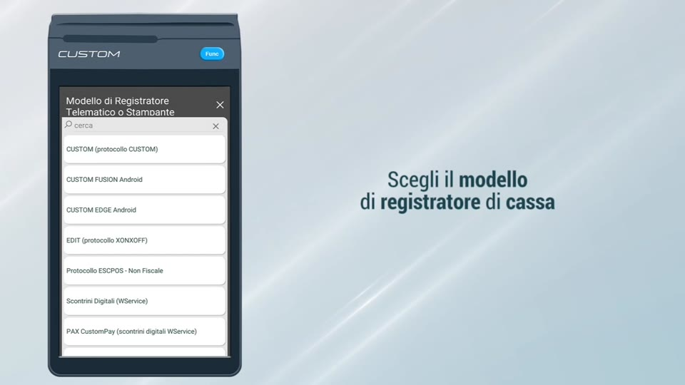
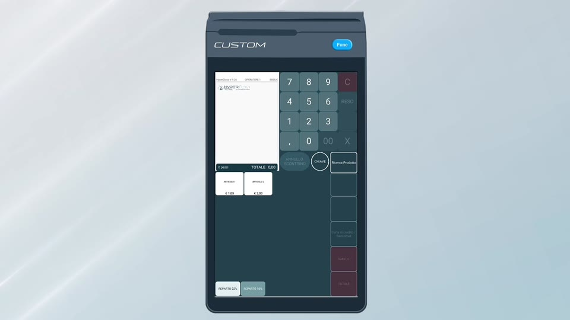

# Primo Accesso — Avvio e Configurazione della Cassa

**HyperRetailCloud StartUp Level 1** | *Custom S.p.A. © 2026*

---

Una volta abbinata la licenza tramite HyperLand, al primo avvio HyperRetailCloud guida il dealer attraverso la configurazione iniziale del dispositivo. Il passaggio principale è la **selezione del modello di registratore di cassa** collegato alla postazione.

---

## Scelta del modello di registratore di cassa

HyperRetailCloud supporta diversi protocolli e modelli di stampante fiscale. Al primo avvio il sistema presenta l'elenco completo dei modelli supportati:

{ width=680 }

| Modello / Protocollo | Utilizzo tipico |
|----------------------|-----------------|
| **CUSTOM (protocollo CUSTOM)** | Registratori Custom con protocollo nativo |
| **CUSTOM FUSION Android** | Dispositivo Custom FUSION con Android integrato |
| **CUSTOM EDGE Android** | Dispositivo Custom EDGE con Android integrato |
| **EDIT (protocollo XONXOFF)** | Registratori EDIT tramite protocollo seriale XON/XOFF |
| **Protocollo ESCPOS – Non Fiscale** | Stampanti non fiscali ESC/POS (ricevute, etichette) |
| **Scontrini Digitali (WService)** | Emissione scontrino digitale tramite web service |
| **PAX CustomPay (scontrini digitali WService)** | Terminale PAX con scontrino digitale integrato |

Seleziona il modello corrispondente all'hardware installato presso il cliente e conferma. La configurazione viene salvata in automatico e non è necessario ripeterla ai successivi avvii.

!!! warning "Attenzione alla scelta"
    Selezionare il protocollo errato impedisce la comunicazione con il registratore di cassa. In caso di dubbio, contatta il supporto Custom S.p.A. per verificare il modello installato.

---

## Prima schermata di vendita operativa

Dopo la configurazione, HyperRetailCloud mostra direttamente la **schermata di vendita**. Se sono già stati configurati reparti e articoli dalla Web Console, questi compaiono immediatamente nella griglia — pronti per l'uso.

{ width=680 }

La schermata di vendita è composta da:

- **Area scontrino** (sinistra) — mostra le righe del conto in corso con prezzi e totale
- **Tastierino numerico** (centro) — per digitare quantità e importi
- **Tasti funzione** (destra) — azioni rapide: Annullo Scontrino, Chiave, Ricerca Prodotto, Subtotale, Totale
- **Barra reparti** (in basso) — un tasto per ogni reparto configurato, per l'inserimento rapido a reparto

!!! tip "La cassa è già operativa"
    Dopo la selezione del registratore, la cassa è immediatamente operativa. Gli articoli inseriti dalla Web Console sono già sincronizzati e disponibili senza nessun riavvio.

---

[← Gestione Licenze](cap1_hyperland.md) | [Anagrafiche e Schermate →](cap2_anagrafiche.md)

*Custom S.p.A. © 2026 — Uso riservato ai partner autorizzati*
