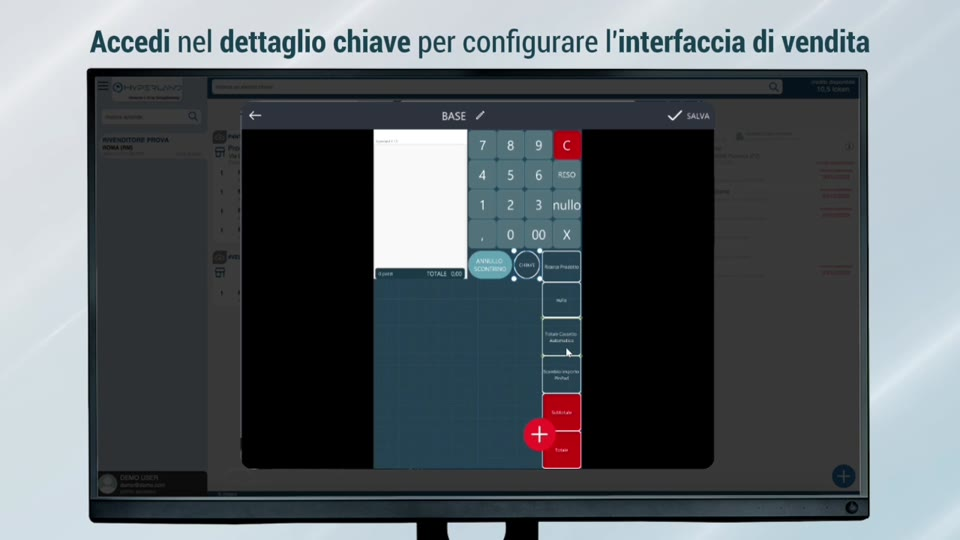
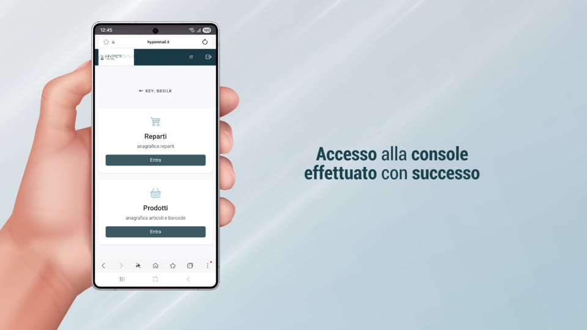
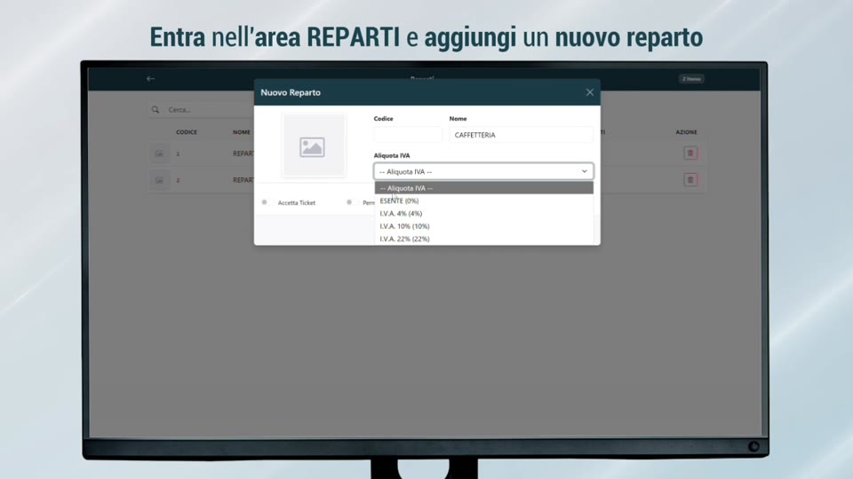
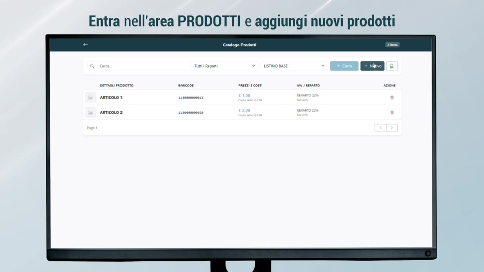
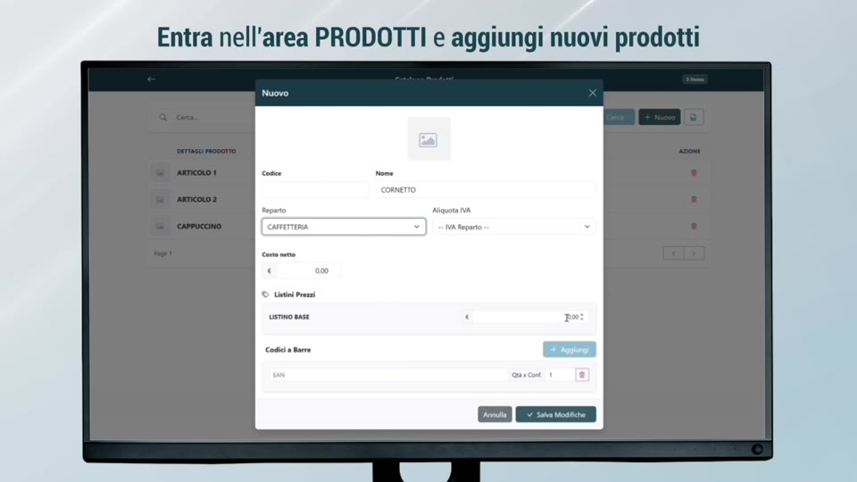
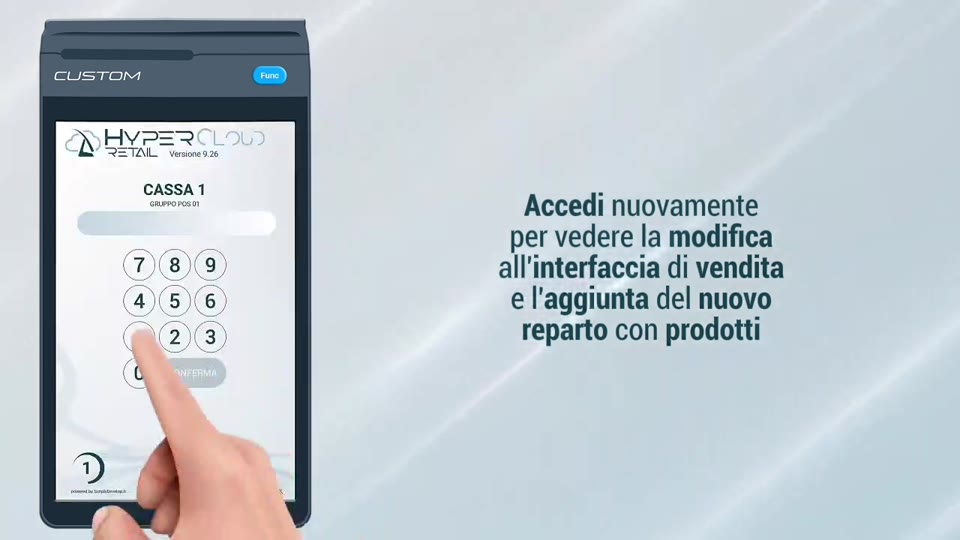

# Tutorial — Inserimento Articoli e Reparti

**HyperRetailCloud StartUp Level 1** | *Custom S.p.A. © 2026*

---

Questo tutorial mostra passo-passo come popolare l'anagrafica di HyperRetailCloud: creare i reparti merceologici e inserire gli articoli tramite barcode cloud dalla Web Console.

---

## 🎬 Video tutorial

<div markdown="block" style="max-width:720px;">
<video controls width="100%">
<source src="../assets/resources/hc_articoli_reparti.mp4" type="video/mp4">
Il tuo browser non supporta la riproduzione video nativa.
</video>
</div>

---

## Passo 1 — Accedere alla Web Console

La Web Console è il punto di partenza per tutta la gestione anagrafica. Si accede in due modi:

**Da HyperLand (accesso partner):**

1. Apri HyperLand sul tuo dispositivo
2. Seleziona la licenza del cliente dall'elenco chiavi
3. Tocca **"Dettaglio chiave"** → tasto **"Web Console HyperRetailCloud"**

{ width=680 }

**Da browser diretto (accesso cliente):**

1. Apri qualsiasi browser (Chrome, Safari, Edge...)
2. Vai all'indirizzo: **www.hyperetail.it/hypercloud**
3. Accedi con le credenziali del cliente — verifica l'email con il codice PIN ricevuto

{ width=680 }

!!! tip "Funziona su qualsiasi device"
    La Web Console è accessibile da PC, tablet e smartphone — Android, iOS, Windows. Non serve installare nulla.

---

## Passo 2 — Creare i Reparti

I reparti sono le categorie merceologiche della cassa (es. Bar, Cucina, Tabacchi, Retail...). Vanno inseriti **prima** degli articoli, perché ogni prodotto deve essere assegnato a un reparto.

**Procedura:**

1. Dalla homepage della Web Console, seleziona **"Reparti"**
2. Tocca il tasto **"+" (Aggiungi reparto)**
3. Compila i campi:

| Campo | Descrizione | Esempio |
|-------|-------------|---------|
| **Nome reparto** | Nome visualizzato sulla cassa | `Bar`, `Cucina`, `Tabacchi` |
| **IVA** | Aliquota IVA applicata | `10%`, `22%`, `0%` |
| **Colore** | Colore identificativo sulla cassa | Scegli dalla palette |
| **Icona** | Icona grafica del reparto | Opzionale |

4. Salva — il reparto è immediatamente disponibile sulla cassa

{ width=680 }

!!! note "Quanti reparti creare?"
    Crea solo i reparti che il cliente usa effettivamente. Un bar semplice può avere 3-4 reparti (Bar, Cucina, Altro, Tabacchi). Non esagerare: una struttura semplice rende la cassa più veloce da usare.

---

## Passo 3 — Inserire un Articolo via Barcode Cloud

L'inserimento articoli è il punto di forza della Web Console: il sistema recupera automaticamente dal cloud descrizioni e immagini del prodotto, lasciando all'operatore solo prezzo e reparto da compilare.

**Procedura:**

1. Dalla homepage, seleziona **"Prodotti"** → tasto **"+ Nuovo"**
2. **Scansiona il barcode** con la fotocamera del device, oppure digitalo manualmente nel campo EAN
3. Il cloud **riconosce il prodotto** e propone automaticamente:
   - Descrizione e nome commerciale
   - Immagine del prodotto (più opzioni tra cui scegliere)
   - Categoria di appartenenza

{ width=680 }

4. **Seleziona descrizione e immagine** più adatte al cliente
5. Compila i dati obbligatori:

| Campo | Obbligatorio | Note |
|-------|-------------|------|
| **Prezzo di vendita** | ✅ Sì | Il prezzo a cui il cliente vende il prodotto |
| **Reparto** | ✅ Sì | Scegli tra i reparti creati al Passo 2 |
| **IVA** | Auto | Ereditata dal reparto, modificabile |
| **Prezzo di acquisto** | No | Utile per calcolo margini con HyperStore |
| **Listini multipli** | No | Prezzi differenziati (asporto, sera, ecc.) |

6. Salva — l'articolo è disponibile immediatamente sulla cassa

!!! success "Risultato"
    Il prodotto appare sulla cassa nel reparto selezionato, con immagine e prezzo corretti — senza aver digitato nulla manualmente.

---

## Passo 4 — Inserire un Articolo Manualmente (senza barcode)

Per prodotti sfusi, preparazioni proprie o articoli senza barcode (es. caffè, cornetto, coperto):

1. Tasto **"+ Nuovo"**
2. Lascia il campo EAN vuoto (o inserisci un codice interno personalizzato)
3. Digita manualmente:
   - **Nome articolo** (es. "Caffè", "Cornetto Vuoto", "Coperto")
   - **Prezzo di vendita** nel listino BASE
   - **Reparto** di appartenenza

{ width=680 }

4. Aggiungi un'immagine dal dispositivo (opzionale)
5. Salva

!!! tip "Articoli rapidi per bar e ristorazione"
    Per un bar standard, crea prima gli articoli più venduti (caffè, cappuccino, cornetto, acqua, birra). Il resto si aggiunge in un secondo momento — la cassa è già utilizzabile dal giorno 1.

---

## Passo 5 — Verificare il Risultato sulla Cassa

Dopo aver inserito reparti e articoli, verifica che tutto sia corretto direttamente dalla schermata di vendita:

1. Sulla cassa del cliente, apri HyperRetailCloud
2. Tocca il reparto appena creato — gli articoli assegnati compaiono nella griglia
3. Tocca un articolo per aggiungerlo al conto — verifica che prezzo e IVA siano corretti
4. Annulla il conto di prova senza emettere il documento

{ width=680 }

!!! warning "Sincronizzazione in tempo reale"
    Le modifiche dalla Web Console sono sincronizzate in tempo reale. Non è necessario riavviare la cassa: i prodotti compaiono immediatamente.

---

## Riepilogo — Flusso completo

```
INSERIMENTO ANAGRAFICA — FLUSSO COMPLETO
=========================================

① Accedi alla Web Console
   └─ Da HyperLand → Dettaglio Chiave → Web Console
   └─ Oppure da browser: www.hyperetail.it/hypercloud

② Crea i Reparti
   └─ Nome, IVA, colore
   └─ Solo i reparti effettivamente usati dal cliente

③ Inserisci gli Articoli
   └─ Via barcode → cloud propone descrizione e immagine automaticamente
   └─ Oppure manuale per articoli senza EAN (caffè, preparazioni proprie)
   └─ Compila solo prezzo e reparto

④ Verifica sulla Cassa
   └─ Articoli compaiono in tempo reale, senza riavvio
   └─ Test conto di prova → annulla senza emettere documento
```

---

[← Cap. 2 — Anagrafiche e Schermate](cap2_anagrafiche.md) | [Cap. 3 — Primo Accesso e Configurazione →](cap3_primo_accesso.md)

*Custom S.p.A. © 2026 — Uso riservato ai partner autorizzati*
